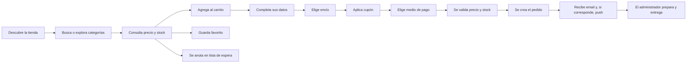
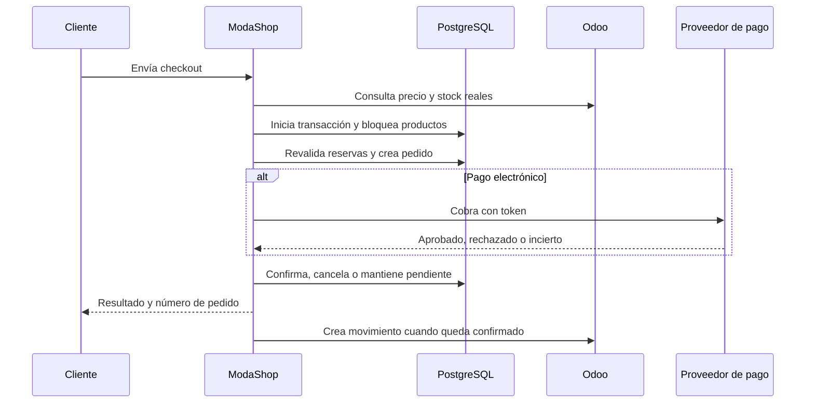
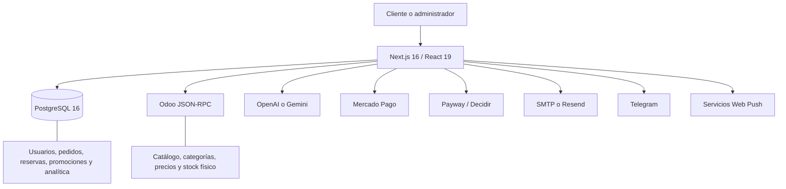

# ModaShop Santa Fe

## Documento de presentación funcional y técnica

**Versión relevada:** 25 de septiembre de 2026

**Base del documento:** revisión directa del código, del modelo de datos, de las integraciones y de los flujos activos de la aplicación.

---

## 1. Resumen ejecutivo

ModaShop es una plataforma de comercio electrónico conectada en tiempo real con Odoo. Combina una tienda pública, un proceso de compra completo, administración comercial, comunicación con clientes, estadísticas y una vendedora virtual con inteligencia artificial.

La solución fue pensada para que cada sistema tenga una responsabilidad clara:

- **Odoo** mantiene el catálogo, las categorías, los precios y el stock físico.
- **ModaShop** administra la experiencia de compra, clientes, promociones, pedidos web, reservas, comunicaciones y análisis.
- **Los proveedores de pago** procesan los datos de tarjeta mediante tokenización.
- **OpenAI o Gemini** pueden operar la vendedora virtual, según la configuración elegida.

El sitio admite compras como invitado o con una cuenta registrada. También puede instalarse como aplicación web en teléfonos y computadoras, enviar notificaciones push y derivar la conversación a WhatsApp dentro del horario comercial.

### Propuesta de valor

- Catálogo sincronizado directamente con Odoo, sin duplicar la administración de productos.
- Control de stock con reservas de pedidos web para reducir la sobreventa.
- Cuatro medios de pago y reglas comerciales configurables.
- Gestión centralizada de ventas, clientes, cupones, envíos y campañas.
- Vendedora virtual conectada al catálogo real.
- Herramientas de recuperación comercial: carritos abandonados, lista de espera, mailing, push y WhatsApp.
- Estadísticas de ventas y visitas desde el mismo panel.
- Experiencia adaptable a escritorio, tablet y dispositivos móviles.

---

## 2. Estado de las funciones

Este documento utiliza tres estados para evitar confundir una función existente con una posibilidad futura.

| Estado | Significado |
|---|---|
| **Operativa** | La función está implementada y forma parte del flujo actual. |
| **Configurable** | Está implementada, pero necesita activación, credenciales o datos desde el panel. |
| **Posibilidad de evolución** | No forma parte del funcionamiento actual; se propone como mejora. |

---

## 3. Tipos de usuario

### Visitante

Puede recorrer el catálogo, buscar productos, usar el carrito, consultar a la vendedora virtual, suscribirse al newsletter, anotarse en una lista de espera y comprar sin crear una cuenta.

### Cliente registrado

Además de comprar, puede guardar favoritos, consultar sus pedidos, ver y canjear puntos, y recibir notificaciones de pedido en sus dispositivos suscriptos.

### Administrador

Accede al panel comercial y puede gestionar ventas, promociones, envíos, comunicaciones, usuarios, contenido visual, configuraciones e integraciones. Las acciones críticas vuelven a validar el rol contra la base de datos.

---

## 4. Recorrido del cliente

---

## 5. Tienda pública: funciones disponibles

### 5.1 Inicio

**Estado: Operativa y configurable**

La página principal funciona como vidriera comercial y punto de acceso al catálogo.

- Barra superior con ubicación e Instagram.
- Navegación a inicio, ubicación, contacto y tienda.
- Buscador de productos con sugerencias mientras se escribe.
- Slider principal de hasta tres piezas, administrable desde el panel.
- Cada pieza puede incluir imagen, texto superior, título, subtítulo, promoción, orden y hasta tres llamados a la acción.
- Franja animada con textos promocionales editables.
- Bloque de beneficios comerciales: pagos, envíos y retiro.
- Carrusel de categorías destacadas elegidas por el administrador.
- Carrusel de productos destacados.
- Información de contacto y ubicación.
- Formulario de suscripción al newsletter.

La portada puede modificarse sin editar código. El catálogo mostrado continúa viniendo de Odoo.

### 5.2 Catálogo y tienda

**Estado: Operativa**

- Consulta los productos activos directamente en Odoo.
- Publica únicamente artículos vendibles y con imagen.
- Pagina los resultados para mantener una navegación ágil.
- Permite buscar por texto.
- Permite recorrer categorías y subcategorías.
- Calcula cantidades por categoría incluyendo sus ramas descendientes.
- Permite ordenar y filtrar la navegación desde la interfaz disponible.
- Muestra precio, imagen, categoría y disponibilidad.
- Puede ocultar por completo los productos sin stock mediante una opción administrativa.
- Permite abrir la imagen del producto en una vista ampliada.

La disponibilidad publicada considera el stock físico informado por Odoo y descuenta las unidades ya reservadas por pedidos web pendientes o confirmados.

### 5.3 Categorías

**Estado: Operativa**

- Conservan la estructura jerárquica de Odoo.
- Se usan para navegar el catálogo.
- Se pueden destacar categorías concretas en la portada.
- Participan en cupones, descuentos por medio de pago y recomendaciones.
- Cuando una regla corresponde a una categoría superior, puede alcanzar a sus subcategorías.

### 5.4 Buscador

**Estado: Operativa**

- Ofrece sugerencias en la barra de navegación.
- Lleva la consulta a la tienda para mostrar resultados completos.
- Consulta información real del catálogo.
- Está disponible tanto en escritorio como en la navegación móvil.

### 5.5 Tarjeta de producto

**Estado: Operativa**

Cada tarjeta permite:

- Ver nombre, imagen, precio y estado de stock.
- Ampliar la imagen.
- Agregar el artículo al carrito.
- Marcarlo como favorito si existe una sesión iniciada.
- Abrir el acceso a registro o ingreso cuando una función requiere cuenta.
- Solicitar aviso mediante lista de espera si no hay unidades, salvo que los productos sin stock estén ocultos.

### 5.6 Favoritos

**Estado: Operativa para clientes registrados**

- Agregado y eliminación con respuesta inmediata en pantalla.
- Persistencia por usuario en PostgreSQL.
- Vista exclusiva dentro de “Mi cuenta”.
- Actualización del precio, imagen y stock desde Odoo cada vez que se consulta la lista.

La base local guarda la relación entre usuario y producto; Odoo continúa siendo la fuente de la información comercial.

### 5.7 Lista de espera

**Estado: Operativa con seguimiento manual**

Cuando un artículo no tiene stock, el visitante puede registrar su interés dejando sus datos. El panel muestra:

- Producto y categoría.
- Nombre, email y teléfono del interesado.
- Fecha de alta.
- Acceso a WhatsApp si el teléfono es válido.
- Copia conjunta de correos para campañas.
- Eliminación individual del registro.

Actualmente el sistema reúne los contactos, pero no envía automáticamente un aviso cuando vuelve el stock.

### 5.8 Carrito

**Estado: Operativa**

- Se conserva en el navegador mediante almacenamiento local.
- Permite sumar, restar o quitar unidades.
- Respeta la última disponibilidad conocida por la interfaz.
- Calcula subtotal y cantidad de artículos.
- Muestra recomendaciones relacionadas con las categorías del carrito.
- Puede abrirse como panel lateral desde cualquier página.
- Genera una instantánea silenciosa del carrito para recuperación comercial.
- Elimina esa instantánea cuando el carrito se vacía o la compra finaliza.

La validación definitiva se realiza en el servidor durante el checkout; el contenido del navegador nunca se toma como precio ni stock autorizado.

### 5.9 Carritos abandonados

**Estado: Operativa con recuperación manual**

El sistema conserva la última instantánea disponible de un carrito mediante un identificador anónimo del navegador y, cuando existen, los datos del usuario.

El administrador puede:

- Filtrar entre clientes registrados, invitados identificados y sesiones anónimas.
- Ver última actividad, artículos, cantidades y valor estimado.
- Copiar correos.
- Abrir un mensaje de recuperación por WhatsApp cuando existe teléfono.
- Eliminar un registro.
- Limpiar carritos con más de 30 días.

No existe todavía una automatización que determine por tiempo cuándo abandonar el carrito y envíe el mensaje por sí sola.

### 5.10 Registro e inicio de sesión

**Estado: Operativa**

- Alta con nombre, email y contraseña.
- Contraseña de al menos ocho caracteres.
- Contraseñas protegidas con `bcrypt`.
- Inicio con credenciales.
- Inicio mediante Google OAuth si sus credenciales están configuradas.
- Sesión basada en JWT.
- Reutilización de una cuenta existente cuando Google informa el mismo email.
- Modal de acceso integrado en la experiencia de compra.

### 5.11 Mi cuenta

**Estado: Operativa**

El cliente registrado dispone de:

- **Pedidos:** historial y estado de sus compras.
- **Favoritos:** productos guardados con información actualizada.
- **Puntos:** saldo, movimientos y recompensas disponibles.

### 5.12 Newsletter

**Estado: Operativa**

- Captura el email desde la tienda.
- Evita duplicados mediante una restricción única.
- Incorpora esos contactos como audiencia del módulo de mailing.
- Permite administrar y eliminar suscriptores desde el panel.

### 5.13 Instalación como Web App

**Estado: Operativa en navegadores compatibles**

La tienda cuenta con manifiesto, iconos y service worker, por lo que puede instalarse desde el navegador como una PWA.

- Acceso desde el escritorio o la pantalla de inicio.
- Apertura en modo aplicación.
- Identidad visual propia.
- Botón guiado de instalación cuando el navegador lo permite.
- Solicitud de permiso para notificaciones push.

El service worker no guarda el catálogo para uso sin conexión. Esta decisión evita mostrar precios o stock antiguos.

### 5.14 Diseño adaptable y accesibilidad

**Estado: Operativa**

- Navegación específica para pantallas pequeñas.
- Panel administrativo con menú móvil.
- Soporte para anchos reducidos, incluido un ancho objetivo de 320 px.
- Uso de altura dinámica de pantalla en dispositivos móviles.
- Respeto de áreas seguras de iPhone.
- Campos con tamaño adecuado para evitar zoom involuntario en iOS.
- Áreas táctiles amplias.
- Tablas administrativas desplazables horizontalmente.
- Reducción de animaciones cuando el sistema operativo lo solicita.

---

## 6. Checkout, pagos y pedidos

### 6.1 Datos del comprador

**Estado: Operativa**

La compra puede realizarse como invitado o con una cuenta. Se solicitan:

- Nombre.
- Email.
- Teléfono.
- Domicilio cuando el método de envío lo requiere.

Si el cliente está registrado, el teléfono informado puede incorporarse a su perfil para futuras operaciones.

### 6.2 Métodos de envío

**Estado: Operativa y configurable**

El administrador puede crear, editar y eliminar alternativas de entrega con:

- Nombre.
- Descripción.
- Costo.
- Estado activo o inactivo.
- Requisito de domicilio.

También puede decidir qué alternativas se permiten para cada medio de pago. El checkout solo ofrece las combinaciones válidas.

### 6.3 Cupones

**Estado: Operativa y configurable**

Los cupones pueden aplicar:

- Descuento porcentual o monto fijo.
- Restricción por categoría.
- Restricción por producto.
- Restricción por medio de pago.
- Compra mínima.
- Fecha de vencimiento.
- Cantidad máxima de usos.
- Activación o desactivación manual.

Los canjes del programa de puntos generan cupones personales de un solo uso.

### 6.4 Descuentos por medio de pago

**Estado: Operativa y configurable**

Cada medio puede tener un descuento general y excepciones por categoría. Cuando varias categorías coinciden, prevalece la regla más específica. El servidor vuelve a calcular el beneficio antes de guardar el pedido.

### 6.5 Transferencia bancaria

**Estado: Configurable**

- Muestra CBU, alias y titular definidos por el administrador.
- Solicita comprobante en imagen o PDF.
- Registra el pedido como pendiente.
- Reserva el stock web.
- Requiere revisión y confirmación manual desde ventas.

### 6.6 Pago contra entrega

**Estado: Configurable**

- Genera el pedido como pendiente.
- Reserva el stock web.
- Permite aplicar descuentos configurados para el medio.
- Requiere confirmación administrativa.

### 6.7 Mercado Pago

**Estado: Configurable mediante credenciales**

- La tarjeta se tokeniza en el navegador con el SDK del proveedor.
- La aplicación recibe un token, no los datos completos de tarjeta.
- El servidor crea primero el pedido y protege su stock.
- El pedido se confirma automáticamente cuando Mercado Pago aprueba el pago.
- Un rechazo explícito cancela el pedido y libera la reserva.
- Una respuesta incierta conserva el pedido pendiente para conciliación manual.

### 6.8 Payway/Decidir

**Estado: Configurable mediante credenciales**

- Tokenización de tarjeta en el navegador.
- Procesamiento en el servidor contra el proveedor.
- Información antifraude requerida por Cybersource.
- Alternancia entre entorno de prueba y producción.
- Confirmación automática ante aprobación.
- Cancelación y liberación de reserva ante rechazo explícito.
- Conservación como pendiente cuando el resultado no es concluyente.

### 6.9 Validación del pedido

**Estado: Operativa**

Antes de aceptar una venta, el servidor:

1. Normaliza productos y cantidades.
2. Agrupa artículos repetidos.
3. Descarta entradas inválidas.
4. Vuelve a consultar en Odoo el nombre, precio, categoría y stock.
5. Recalcula cupón, descuento de pago, envío y total.
6. Ejecuta la operación dentro de una transacción.
7. Usa bloqueos consultivos de PostgreSQL por producto para evitar que dos compras simultáneas consuman la misma unidad.
8. Guarda el pedido y sus artículos.
9. Reserva las unidades dentro del stock web.

### 6.10 Estados de un pedido

| Estado | Uso |
|---|---|
| **Pendiente** | Espera confirmación de pago o revisión administrativa. Reserva stock web. |
| **Confirmado** | El pago o la operación fueron aceptados. Reserva stock y crea el movimiento correspondiente en Odoo. |
| **Entregado** | La entrega fue validada. Deja de formar parte de la reserva web y puede acreditar puntos. |
| **Cancelado** | La operación fue anulada y su reserva se libera. |

### 6.11 Integración del pedido con Odoo

La instalación actual utiliza Odoo como catálogo e inventario. Al confirmar el pedido:

- Se busca o crea el contacto del cliente en Odoo.
- Se crea un `stock.picking` de salida de forma idempotente.
- Se crean los movimientos por artículo.
- Se confirma y asigna la operación de inventario.
- Un proceso periódico revisa las entregas validadas en Odoo.
- Cuando detecta una entrega, actualiza el pedido web y libera su reserva.

Esta instalación no depende del módulo de Ventas de Odoo para generar una orden comercial: ModaShop conserva el pedido y Odoo recibe el contacto y el movimiento de inventario.

### 6.12 Confirmaciones y avisos

**Estado: Configurable**

Después de una compra pueden ejecutarse:

- Email de confirmación con contenido editable.
- Notificación por Telegram al comercio.
- Notificación push al cliente registrado en todos sus dispositivos suscriptos.

Los errores de email, Telegram o push se procesan por separado y no anulan una venta ya registrada.

---

## 7. Vendedora virtual con inteligencia artificial

### 7.1 Objetivo

**Estado: Configurable**

La vendedora virtual atiende consultas comerciales, interpreta necesidades y recomienda artículos del catálogo. Puede utilizar **OpenAI** o **Google Gemini** sin cambiar la experiencia del cliente.

### 7.2 Información que puede consultar

- Productos por texto.
- Productos por categoría.
- Rango de precios.
- Disponibilidad de stock.
- Listado de categorías.
- Medios de pago activos.
- Alternativas de envío.
- Disponibilidad del vendedor humano por WhatsApp.

Las recomendaciones aparecen como tarjetas de producto y pueden agregarse al carrito directamente desde el chat.

### 7.3 Configuración comercial

El administrador de la tienda puede:

- Activar o desactivar la vendedora.
- Definir el nombre visible y el mensaje de bienvenida.
- Escribir instrucciones comerciales para orientar la forma de vender.
- Elegir los días de atención humana.
- Definir hora de inicio y fin de WhatsApp.

La configuración técnica se mantiene en una sección separada y protegida:

- Proveedor de IA.
- Modelo.
- API key.

### 7.4 Reglas de seguridad de la conversación

La instrucción base obliga al modelo a:

- Consultar herramientas antes de afirmar qué productos existen.
- No inventar precios, stock, promociones ni políticas.
- No pedir datos financieros sensibles.
- Tratar los datos obtenidos del catálogo como información, no como instrucciones.
- Ofrecer ayuda humana cuando corresponda.

Además:

- Los mensajes tienen un máximo de 600 caracteres.
- El cuerpo de la solicitud tiene un máximo de 16 KB.
- Se limita la frecuencia por sesión y por dirección IP.
- Se envía al modelo una ventana reducida de la conversación.
- El historial se guarda por sesión anónima en PostgreSQL.
- “Limpiar chat” elimina el historial del servidor y crea una sesión nueva.

### 7.5 Derivación a WhatsApp

La disponibilidad se calcula con la zona horaria de Argentina/Córdoba y admite horarios que atraviesan la medianoche.

- Dentro del horario, el asistente puede ofrecer conexión con un vendedor.
- Fuera del horario, informa que la atención humana está cerrada.
- Si la IA está desactivada o no está configurada, se muestra directamente el acceso a WhatsApp según el horario definido.
- El estado se actualiza periódicamente sin recargar la página.

### 7.6 Dependencias y costos

Para responder con IA se necesita una API key válida del proveedor elegido y saldo o facturación habilitada. El consumo depende del modelo, la extensión de las conversaciones y la cantidad de consultas. La búsqueda de productos usa el catálogo existente; no requiere entrenar un modelo propio.

---

## 8. Comunicaciones y marketing

### 8.1 Mailing

**Estado: Configurable**

El módulo permite componer campañas con asunto, título y mensaje. Las audiencias disponibles son:

- Usuarios registrados.
- Suscriptores del newsletter.
- Contactos de carritos abandonados.
- Contactos de la lista de espera.

El sistema elimina emails repetidos entre audiencias, aplica una plantilla visual de la marca, envía la campaña en segundo plano y conserva un historial con destinatarios, enviados y estado.

Puede trabajar con:

- Servidor SMTP mediante Nodemailer.
- API de Resend.

También incluye un límite mensual configurable para controlar volumen y costos.

### 8.2 Notificaciones push

**Estado: Operativa en dispositivos suscriptos**

El administrador puede enviar un mensaje a todos los dispositivos que instalaron o habilitaron la Web App:

- Título de hasta 80 caracteres.
- Mensaje de hasta 200 caracteres.
- Enlace interno opcional.
- Historial con cantidad prevista, envíos correctos y estado.

La plataforma genera y conserva las claves VAPID de la instalación. Cuando un navegador elimina una suscripción, las respuestas 404 o 410 permiten depurarla automáticamente.

Actualmente las campañas push son generales para todos los dispositivos suscriptos; no existe segmentación por audiencia.

### 8.3 Telegram

**Estado: Configurable**

- Token del bot y chat de destino administrables.
- Botón de prueba desde configuración.
- Aviso de nuevo pedido al comercio.

### 8.4 WhatsApp

**Estado: Configurable**

- Handoff desde la vendedora virtual.
- Acceso directo cuando la IA se desactiva.
- Horarios y días administrables.
- Enlaces de recuperación desde carritos abandonados.
- Enlaces de contacto desde lista de espera.

---

## 9. Panel administrativo: función por función

### 9.1 Inicio

Presenta una vista ejecutiva de la operación:

- Facturación confirmada del mes.
- Variación contra el mes anterior.
- Pedidos pendientes, confirmados y cancelados.
- Usuarios totales y altas recientes.
- Carritos abandonados y valor estimado.
- Interesados en lista de espera.
- Suscriptores y campañas de correo.
- Evolución de ingresos confirmados durante los últimos 14 días.
- Pedidos recientes.
- Distribución por medio de pago.
- Estado de conexión con Odoo.
- Total de productos, agotados y con stock bajo.
- Aviso visible si el mantenimiento está activado.

### 9.2 Productos

El módulo funciona como consulta en vivo del catálogo de Odoo:

- Búsqueda por texto.
- Filtro de categoría.
- Rango de precio.
- Rango de stock.
- Orden por nombre, precio, stock o categoría.
- Paginación.
- Stock físico y unidades reservadas por la web.

Los productos no se editan desde ModaShop. Altas, cambios de precio, imágenes, categorías y stock físico se administran en Odoo.

### 9.3 Ventas

- Búsqueda por nombre, email o teléfono.
- Filtros por estado, medio de pago y producto.
- Paginación.
- Detalle completo del pedido y sus artículos.
- Vista de comprobantes en imagen o PDF.
- Cambio manual de estado.
- Eliminación administrativa.
- Creación del movimiento Odoo al confirmar.
- Liberación de reservas al cancelar o entregar.
- Registro de auditoría de los cambios de estado y eliminaciones.

### 9.4 Estadísticas

Permite analizar los últimos 7 días, 30 días, 12 meses o todo el historial, con filtro opcional por medio de pago.

- Ingresos de pedidos confirmados o entregados.
- Comparación con el período anterior.
- Ticket promedio.
- Unidades vendidas.
- Compradores únicos por email.
- Pedidos totales y pendientes.
- Descuentos otorgados.
- Importe cobrado por envíos.
- Pedidos cancelados.
- Serie temporal de ingresos y cantidad de pedidos.
- Productos más vendidos por unidades e ingresos.
- Desglose por medio de pago, envío y estado.

### 9.5 Visitas

- Registra páginas vistas de la tienda pública.
- Excluye la navegación administrativa.
- Mide vistas y sesiones únicas.
- Permite seleccionar períodos y fechas personalizadas.
- Presenta evolución temporal.
- Identifica las páginas más visitadas.

### 9.6 Carritos abandonados

- Vista de instantáneas actuales.
- Filtro por tipo de cliente.
- Detalle de artículos, valor y última actividad.
- Copia de emails.
- Recuperación manual por WhatsApp.
- Eliminación individual.
- Limpieza de registros antiguos.

### 9.7 Lista de espera

- Consulta de interesados por producto.
- Datos de contacto.
- Acceso a WhatsApp.
- Copia de correos.
- Eliminación individual.

### 9.8 Mailing

- Selección de una o varias audiencias.
- Conteo previo de destinatarios.
- Redacción de campaña.
- Envío asincrónico.
- Historial y estado.
- Eliminación de campañas históricas.
- Control de cuota mensual.

### 9.9 Notificaciones push

- Conteo de dispositivos activos.
- Diferenciación de suscripciones vinculadas a cuentas.
- Redacción de título y mensaje.
- Enlace interno opcional.
- Envío masivo en segundo plano.
- Historial y limpieza de campañas.

### 9.10 Medios de pago

- Activación individual de Mercado Pago, Payway, transferencia y contra entrega.
- Descuento general por medio.
- Excepciones de descuento por categoría.
- Restricción de métodos de envío disponibles.
- Credenciales en campos enmascarados.
- Datos bancarios para transferencia.
- Entorno de prueba para Payway.

Al guardar un formulario con el campo de una credencial vacío, se conserva el valor existente. Las claves nunca se muestran nuevamente en texto abierto.

### 9.11 Métodos de envío

- Alta, edición y eliminación.
- Precio.
- Descripción.
- Activación.
- Requisito de domicilio.

### 9.12 Cupones

- Alta, edición y eliminación.
- Código promocional.
- Monto fijo o porcentaje.
- Alcance por producto, categoría o medio de pago.
- Compra mínima.
- Vencimiento y límite de usos.
- Activación.

### 9.13 Puntos y recompensas

**Estado: Configurable**

- Activación general del programa.
- Cantidad de puntos otorgados por cada $1.000.
- Sincronización manual desde el panel.
- Sincronización periódica automática.
- Acreditación solo para clientes registrados y pedidos entregados en Odoo.
- Historial de movimientos.
- Alta, edición y eliminación de recompensas.
- Recompensas porcentuales o de monto fijo.
- Canje atómico: descuenta puntos y crea un cupón personal de un uso dentro de la misma operación.

### 9.14 Usuarios

- Listado y búsqueda.
- Visualización de datos básicos y teléfono disponible.
- Cambio entre rol cliente y administrador.
- Eliminación.

El rol se consulta nuevamente en el servidor, por lo que una revocación administrativa no depende de que venza el JWT anterior.

### 9.15 Suscriptores

- Listado de emails del newsletter.
- Fecha de suscripción.
- Eliminación individual.

### 9.16 Registro de actividad

El panel presenta fecha, administrador, acción y detalle con paginación. En la implementación actual se registran de forma explícita:

- Cambios de estado y eliminación de pedidos.
- Activación o desactivación de medios de pago.
- Actualización de configuración de pagos.
- Creación, modificación y eliminación de descuentos por categoría.

Puede ampliarse el registro a las demás acciones administrativas si se necesita una auditoría integral.

### 9.17 Configuración general

La sección se organiza en pestañas:

#### General

- Modo mantenimiento.
- Ocultar productos agotados.
- Sincronización de puntos.
- Instagram, WhatsApp, dirección y email de contacto.
- Textos de la franja promocional.
- Categorías destacadas.

#### Franquicia

- Nombre de la franquicia.
- Ubicación identificatoria.

#### Email de compra

- Introducción.
- Texto específico por medio de pago.
- Cierre.
- Variables de nombre del cliente y número de pedido.

#### Telegram

- Token.
- Chat ID.
- Envío de prueba.

#### Vendedora IA

- Activación o desactivación.
- Nombre visible y mensaje de bienvenida.
- Instrucciones comerciales para vender.
- Días y horario de atención por WhatsApp.

#### Slider

- Creación, edición, orden y eliminación de hasta tres piezas.

### 9.18 Configuración técnica de integraciones

Existe una ruta protegida y separada del menú comercial para reducir cambios accidentales. Permite configurar:

- URL, base, usuario y API key de Odoo.
- Proveedor, modelo y API key de la IA.
- Proveedor de correo, SMTP o Resend.
- Remitente y credenciales de correo.
- Prueba de envío.

### 9.19 Manual de uso

La aplicación incluye un manual HTML autónomo con capturas para demostración y capacitación. Se accede mediante enlace directo, está marcado para no ser indexado por buscadores y no exige iniciar sesión. Esta decisión facilita la presentación a franquicias, aunque debe considerarse si el contenido futuro incluye información sensible.

### 9.20 Modo mantenimiento

- Puede activarse desde el panel.
- Los clientes son enviados a una página de mantenimiento.
- Los administradores pueden seguir revisando la tienda.
- El manual permanece accesible por enlace.

---

## 10. Arquitectura

### Responsabilidad de los datos

| Información | Fuente principal | Motivo |
|---|---|---|
| Productos, imágenes, categorías y precios | Odoo | Evita mantener dos catálogos. |
| Stock físico | Odoo | Refleja el inventario operativo. |
| Reservas de compras web | PostgreSQL | Protege unidades antes de la entrega física. |
| Pedidos web y sus artículos | PostgreSQL | Conserva el flujo comercial del sitio. |
| Usuarios, favoritos y puntos | PostgreSQL | Funciones propias de la experiencia web. |
| Cupones, pagos y envíos configurables | PostgreSQL | Reglas comerciales de la tienda. |
| Carrito activo | Navegador y snapshot en PostgreSQL | Persistencia inmediata y recuperación comercial. |
| Datos completos de tarjeta | Proveedor de pago | La aplicación usa tokens y no almacena la tarjeta. |

---

## 11. Tecnologías utilizadas

| Área | Tecnología | Función |
|---|---|---|
| Aplicación web | Next.js 16.2.11 con App Router | Renderizado, rutas, API y acciones de servidor. |
| Interfaz | React 19.2.4 | Componentes y estados interactivos. |
| Lenguaje | TypeScript 5 | Tipado y mantenimiento del código. |
| Estilos | Tailwind CSS 4 | Diseño adaptable y sistema visual. |
| Animaciones | Framer Motion 12 | Transiciones y movimientos de interfaz. |
| Base de datos | PostgreSQL 16 | Persistencia transaccional. |
| ORM | Prisma ORM 7.9 + adaptador `pg` | Modelo, consultas y migraciones. |
| Autenticación | NextAuth 5 beta | Credenciales, Google y sesiones JWT. |
| Contraseñas | bcryptjs | Hash seguro de credenciales. |
| ERP | Odoo por JSON-RPC | Catálogo, contactos e inventario. |
| IA | OpenAI SDK 6 o Google GenAI 2 | Vendedora virtual y herramientas. |
| Pagos | Mercado Pago y Payway/Decidir | Cobros electrónicos tokenizados. |
| Correo | Nodemailer o Resend | Confirmaciones y campañas. |
| Push | Web Push + VAPID | Avisos a navegadores y PWA. |
| Infraestructura | Node.js, PM2, Nginx y SSL | Ejecución y publicación en VPS. |
| Despliegue | Script automatizado + Prisma Migrate | Actualización reproducible del servidor. |

---

## 12. Seguridad y confiabilidad

### Compra y stock

- El servidor no confía en nombres, precios, descuentos ni totales enviados por el navegador.
- El catálogo y stock se vuelven a consultar al confirmar.
- PostgreSQL bloquea por producto las compras simultáneas críticas.
- Los pedidos usan identificadores y referencias idempotentes para tolerar reintentos.
- La reserva web evita vender unidades comprometidas aunque Odoo todavía muestre stock físico.
- La liberación se controla según el estado del pedido.

### Pagos

- Mercado Pago y Payway tokenizan los datos en el navegador.
- La aplicación no almacena números completos ni códigos de seguridad de tarjetas.
- Rechazos explícitos cancelan y liberan stock.
- Respuestas inciertas permanecen pendientes para no asumir un cobro ni perder la trazabilidad.

### Acceso

- Las contraseñas se almacenan con hash.
- Las acciones administrativas exigen una sesión y vuelven a consultar el rol.
- Las rutas de configuración técnica son protegidas.
- Los archivos subidos se entregan mediante rutas controladas.

### Credenciales

- Las API keys se usan únicamente en el servidor.
- Los formularios muestran valores enmascarados y permiten conservarlos sin volver a ingresarlos.
- Actualmente las credenciales configuradas desde el panel se guardan en la base de datos con el mismo nivel de confianza que el servidor. Para instalaciones con mayores requisitos de cumplimiento, se recomienda cifrado de campos o un gestor externo de secretos.

### Inteligencia artificial

- Validación de estructura y tamaño de solicitudes.
- Límite de frecuencia por sesión e IP.
- Historial acotado.
- Herramientas cerradas con argumentos validados.
- Instrucciones para evitar alucinaciones comerciales y recolección de datos sensibles.

El limitador actual vive en la memoria de un proceso. Si la aplicación se distribuye entre varias instancias, conviene trasladarlo a Redis u otro almacenamiento compartido.

### Verificación automatizada existente

La suite actual contiene pruebas de los escenarios de mayor riesgo, entre ellos:

- Manipulación de precios y productos durante checkout.
- Compras y reintentos concurrentes.
- Resultados aprobados, rechazados o inciertos de los proveedores.
- Reembolsos ante fallas posteriores.
- Revocación de rol administrativo.
- Transferencias.
- Validación y horarios de la vendedora virtual.

---

## 13. Operación y despliegue

El proyecto incluye un proceso de despliegue para VPS:

1. Actualiza el repositorio con Git.
2. Instala dependencias.
3. Aplica las migraciones pendientes de Prisma.
4. Elimina la compilación anterior.
5. Genera una compilación de producción.
6. Reinicia la aplicación administrada por PM2.
7. Presenta las últimas líneas del registro.

Nginx puede actuar como proxy inverso y terminar HTTPS. PostgreSQL puede ejecutarse en Docker o en otro servicio compatible. El proceso de Node debe permanecer activo para las tareas periódicas internas, como la sincronización de entregas y puntos.

---

## 14. Alcance actual y límites conocidos

Estas aclaraciones son parte del alcance real de la versión relevada:

1. **El catálogo se edita en Odoo.** El panel web lo consulta, pero no crea ni modifica productos.
2. **La lista de espera no avisa automáticamente.** Proporciona contactos para una acción manual o campaña.
3. **La recuperación de carritos es manual.** No existe una secuencia automática por email o WhatsApp.
4. **Los resultados de pago inciertos requieren conciliación.** No hay webhooks ni consulta automática posterior al proveedor.
5. **Las notificaciones push masivas no tienen segmentos.** Alcanzan a todos los dispositivos activos.
6. **La PWA no funciona como catálogo offline.** Es una decisión para evitar datos comerciales desactualizados.
7. **La IA depende de un proveedor externo.** Requiere credenciales, facturación y disponibilidad del servicio.
8. **Las tareas periódicas dependen de un proceso persistente.** Un despliegue serverless necesitaría un cron externo.
9. **Los identificadores de operación de almacén de Odoo responden a la instalación actual.** Para replicar la solución en otras franquicias conviene volverlos configurables.
10. **No existe actualmente recuperación de contraseña por email.** Un administrador puede gestionar usuarios, pero el autoservicio de restablecimiento es una mejora pendiente.

---

## 15. Posibilidades de evolución

### Prioridad comercial alta

- Aviso automático de reposición por email, push o WhatsApp.
- Secuencias automáticas para carritos abandonados.
- Webhooks y conciliación automática de Mercado Pago y Payway.
- Segmentación de campañas push por clientes, actividad o intereses.
- Recuperación de contraseña.

### Escalabilidad y operación

- Configuración por franquicia de depósitos, ubicaciones y tipos de operación Odoo.
- Limitación de IA compartida mediante Redis.
- Gestor externo o cifrado de credenciales.
- Ejecución de tareas programadas mediante cron administrado.
- Exportación de reportes comerciales en CSV o Excel.

### Experiencia comercial

- Reglas de recomendación basadas en ventas.
- Automatizaciones posteriores a la compra.
- Segmentos de mailing más específicos.
- Alertas administrativas de stock bajo.
- Tablero comparativo entre locales o franquicias.

---

## 16. Guion sugerido para presentar la aplicación

### Apertura

> ModaShop conecta la venta online con el inventario real de Odoo y reúne en una sola plataforma la tienda, los cobros, la atención, el seguimiento comercial y las estadísticas.

### Demostración sugerida

1. Mostrar la portada y explicar que el contenido promocional es editable.
2. Buscar un producto y navegar una categoría para demostrar la conexión en vivo con Odoo.
3. Agregar un producto al carrito y enseñar recomendaciones relacionadas.
4. Abrir la vendedora virtual, consultar por una necesidad y agregar una recomendación al carrito.
5. Recorrer el checkout, mostrando envíos, cupones y medios de pago.
6. Explicar la validación de precios y la reserva segura de stock.
7. Ingresar al panel y revisar una venta, estadísticas y estado de Odoo.
8. Mostrar carritos abandonados, lista de espera, mailing y notificaciones push.
9. Cerrar con las configuraciones que permiten adaptar la solución a cada franquicia.

### Mensajes centrales

- El comercio mantiene el catálogo donde ya trabaja: Odoo.
- La tienda protege precios, stock y pagos en el servidor.
- La atención combina IA y derivación humana.
- El panel aporta herramientas concretas para vender, medir y recuperar oportunidades.
- La solución está preparada para crecer por módulos.

---

## 17. Inventario de rutas de la aplicación

### Experiencia pública

| Ruta | Función |
|---|---|
| `/` | Portada, contenidos comerciales y acceso al catálogo. |
| `/tienda` | Catálogo, búsqueda, categorías y paginación. |
| `/categoria/[id]` | Navegación de una categoría concreta. |
| `/carrito` | Carrito y checkout. |
| `/carrito/gracias` | Confirmación de pedido. |
| `/login` | Inicio de sesión. |
| `/registro` | Creación de cuenta. |
| `/mi-cuenta/pedidos` | Historial de compras. |
| `/mi-cuenta/favoritos` | Productos favoritos. |
| `/mi-cuenta/puntos` | Saldo, movimientos y canjes. |
| `/mantenimiento` | Pantalla pública durante mantenimiento. |
| `/manual` | Manual de uso por enlace directo. |

### Administración

| Ruta | Función |
|---|---|
| `/admin/inicio` | Resumen ejecutivo. |
| `/admin/productos` | Consulta del catálogo Odoo. |
| `/admin/ventas` | Gestión de pedidos. |
| `/admin/estadisticas` | Analítica comercial. |
| `/admin/visitas` | Analítica de navegación. |
| `/admin/carritos-abandonados` | Recuperación de carritos. |
| `/admin/lista-espera` | Interesados en productos agotados. |
| `/admin/mailing` | Campañas de correo. |
| `/admin/notificaciones` | Campañas push. |
| `/admin/pagos` | Medios de pago y descuentos. |
| `/admin/envios` | Métodos de entrega. |
| `/admin/cupones` | Promociones por código. |
| `/admin/puntos` | Programa de fidelización. |
| `/admin/usuarios` | Usuarios y roles. |
| `/admin/suscriptores` | Base del newsletter. |
| `/admin/logs` | Registro de acciones. |
| `/admin/configuracion` | Contenido y opciones del sitio. |
| `/odoo_api` | Integraciones técnicas protegidas. |

### API interna

| Grupo | Función |
|---|---|
| `/api/auth/*` y `/api/register` | Autenticación y registro. |
| `/api/products/*` y `/api/categories` | Catálogo consultado desde Odoo. |
| `/api/cart/sync` | Instantánea del carrito. |
| `/api/orders/*` | Pedidos directos, Mercado Pago y Payway. |
| `/api/payment-methods/*` | Opciones de pago y cálculo previo de descuentos. |
| `/api/shipping-methods` | Envíos permitidos para el checkout. |
| `/api/coupons/validate` | Validación comercial de cupones. |
| `/api/favorites` | Favoritos del usuario. |
| `/api/waitlist` | Alta en lista de espera. |
| `/api/newsletter` | Suscripción al newsletter. |
| `/api/points/*` | Consulta y canje de puntos. |
| `/api/assistant/*` | Estado, conversación y limpieza del chat. |
| `/api/push/*` | Clave pública y suscripciones push. |
| `/api/track` | Registro de visitas. |
| `/api/uploads/*` | Entrega controlada de imágenes y comprobantes. |

---

## 18. Entidades principales

| Entidad | Responsabilidad |
|---|---|
| `User` | Clientes y administradores. |
| `Favorite` | Productos guardados por usuario. |
| `WaitlistEntry` | Interés en artículos sin stock. |
| `StoreSettings` | Configuración global e integraciones. |
| `AiConversation` / `AiMessage` | Historial de la vendedora virtual. |
| `MailCampaign` | Campañas de correo. |
| `PushSubscription` / `PushCampaign` | Dispositivos y campañas push. |
| `HeroSlide` | Contenido principal de la portada. |
| `PointReward` / `PointTransaction` | Recompensas y movimientos de fidelización. |
| `NewsletterSubscriber` | Audiencia de newsletter. |
| `AdminLog` | Auditoría administrativa disponible. |
| `PaymentMethodConfig` | Medios de pago y credenciales. |
| `PaymentMethodCategoryDiscount` | Excepciones de descuento por categoría. |
| `ShippingMethod` | Alternativas de entrega. |
| `PaymentMethodShipping` | Compatibilidad entre pago y envío. |
| `Coupon` | Códigos promocionales y sus reglas. |
| `PageView` | Analítica de visitas. |
| `AbandonedCart` | Última instantánea recuperable del carrito. |
| `Order` / `OrderItem` | Pedido, estado, importes y artículos. |

---

## 19. Cierre para presentación

ModaShop es una solución de venta conectada con la operación real del negocio. Su fortaleza principal está en reunir catálogo e inventario de Odoo, checkout seguro, administración comercial, fidelización, comunicaciones y asistencia inteligente dentro de una experiencia única.

La versión actual cubre el recorrido completo desde el descubrimiento de un producto hasta su reserva, cobro, preparación y entrega. Al mismo tiempo, deja identificadas las extensiones necesarias para automatizar la recuperación comercial, reforzar la conciliación de pagos y adaptar la plataforma a una red mayor de franquicias.
